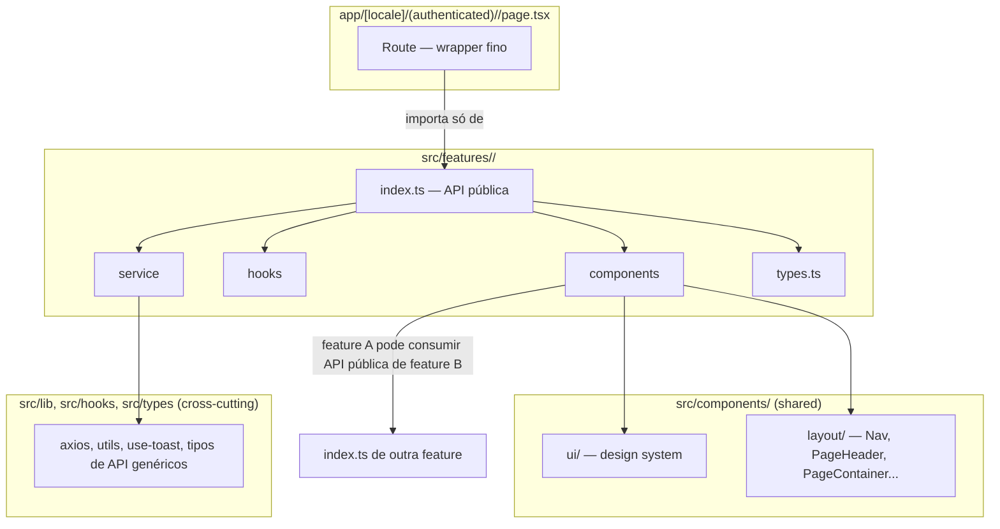

# Frontend Architecture Refactor Design

**Spec**: `.specs/features/frontend-architecture-refactor/spec.md`
**Context**: `.specs/features/frontend-architecture-refactor/context.md`
**Status**: Draft

---

## Architecture Overview

Migração de `apps/frontend/src` de organização por tipo técnico para organização **feature-based/domain-driven**, com estrutura interna **adaptativa por tamanho** (confirmado com o usuário): features pequenas (≤6 arquivos) ficam flat na raiz da feature; features grandes ganham uma subpasta `components/` só pra não poluir a raiz — hooks/services/types continuam flat em qualquer tamanho, pois nunca chegam a ser muitos arquivos por domínio.

Nenhuma mudança de runtime: é puramente um remapeamento de arquivos + splits internos + barrel exports + docs. O comportamento (`AD-001` local-first de work-timer, fluxos de auth, cálculo de invoice etc.) é preservado byte-a-byte na lógica — só o caminho dos arquivos e, em alguns casos, o nome/tamanho dos arquivos internos mudam.

---

## Approach Confirmado

Duas decisões de abordagem já foram fechadas com o usuário antes desta seção:

1. **Feature-based / domain-driven** (vs. atomic design, vs. híbrido reforçado) — confirmado na fase Specify.
2. **Estrutura interna adaptativa por tamanho** (vs. sempre flat, vs. sempre com subpastas fixas) — confirmado nesta fase, ver tabela abaixo.

| Tamanho da feature | Regra |
| --- | --- |
| ≤ 6 arquivos de componente | Tudo flat na raiz de `features/<domain>/` (componentes + hooks + service + types + testes co-localizados) |
| > 6 arquivos de componente | Componentes vão para `features/<domain>/components/`; hooks, service(s) e `types.ts` continuam flat na raiz da feature (nunca chegam a precisar de subpasta própria) |
| Qualquer tamanho | Testes sempre ao lado do arquivo testado (`Componente.tsx` + `Componente.test.tsx`), nunca em `__tests__/` |
| Qualquer tamanho | `index.ts` (barrel) e `README.md` sempre na raiz da feature |

---

## Code Reuse Analysis

### Existing Components to Leverage (permanecem como estão, fora de `features/`)

| Component/Service | Location | Motivo de ficar fora de features/ |
| --- | --- | --- |
| `components/ui/*` (56 arquivos) | `src/components/ui/` | Design system (Radix/Shadcn wrappers) consumido por todos os domínios |
| `PageHeader`, `PageContainer`, `MainLayout`, `Topbar`, `MobileNav`, `EmptyState` | `src/components/layout/` | Scaffold de layout usado em toda rota autenticada |
| `Nav` (hoje em `components/navigation/nav.tsx`) | move para `src/components/layout/nav.tsx` | É navegação de app inteiro, não de 1 domínio — junta-se ao resto do layout scaffold |
| `use-toast`, `use-safe-hydration` | `src/hooks/` | Genuinamente cross-cutting |
| `use-avatar` + `services/avatar.ts` + `services/gravatar.ts` + `services/network-status.ts` + `components/ui/user-avatar.tsx` | permanecem onde estão (`user-avatar.tsx` já em `ui/`; os demais ficam em `hooks/`/`services/` raiz) | Avatar aparece em nav, cards de vários domínios, topbar — não pertence a 1 feature |
| `lib/axios.ts`, `lib/utils.ts` | `src/lib/` | Infra pura, sem regra de negócio de domínio |
| `types/api.ts`, `types/ui.ts` | `src/types/` | Tipos genuinamente cross-domain (contratos de API genéricos, tipos de UI) |
| `test/`, `messages/`, `styles/`, `i18n/`, `providers/` | inalterados | Infra de projeto, não domínio de negócio |

### Integration Points

| Consumo cross-feature | Como resolver |
| --- | --- |
| `features/dashboard` é usado por `app/.../clients/[clientId]/page.tsx` (feature `clients`) e por `app/.../client-dashboard/[clientId]/page.tsx` (rota pública) | `clients` e a rota pública importam de `@/features/dashboard`, nunca de um arquivo interno dele |
| `features/invoices` consome entidades de `features/time-tracking` (uma invoice é gerada a partir de `WorkHour`s) | `invoices` importa `TimeEntry`/`WorkHour`-related types e o service `time-entries` do barrel `@/features/time-tracking`, nunca de um caminho interno |
| `features/analytics` consome dados de `time-tracking`, `dashboard`/reports | Mesma regra: só via barrel público de cada feature |

---

## Domain Map (features finais)

| Feature | Tamanho | Conteúdo migrado (origem) | Observações |
| --- | --- | --- | --- |
| `features/auth` | pequena → flat | `components/auth/*`, `services/auth.ts`, `services/password.ts` (órfão, ver Risks), rotas login/register/forgot-password/reset-password passam a importar daqui | `services/password.ts` não tem consumidor hoje — migra junto por afinidade semântica, documentado como órfão |
| `features/clients` | grande → `components/` | `components/clients/*` (5), `components/addresses/*` (2, subpasta de negócio: Address pertence a Client), `services/clients.ts`, `services/client-stats.ts`, `services/addresses.ts`, `types/client.ts`, `types/address.ts` | `address-combobox.tsx` continua em `components/ui/` (é um primitivo de UI reutilizável, não lógica de domínio) |
| `features/projects` | pequena → flat | `components/projects/*` (4), `services/projects.ts` | — |
| `features/time-tracking` | grande → `components/` (+ `lib/` local) | `components/work-hours/*` (4), `components/work-timer/*` (3), `services/work-hours.ts`, `services/work-hours-stats.ts`, `services/work-sessions.ts`, `services/time-entries.ts`, `lib/work-timer-db.ts`, `lib/work-timer-engine.ts`, `lib/work-timer-sync.ts` | Fusão de `work-hours` + `work-timer` (decisão de Design, ver context.md): mesma página, timer local-first (AD-001) roda em cima dos work-hours. `lib/work-timer-*` vira `features/time-tracking/lib/` — deixa de ser "lib genérica" pois só esse domínio consome |
| `features/invoices` | grande → `components/` | `components/invoices/*` (11), `services/invoices.ts`, `services/invoice-stats.ts`, `types/invoices.ts` | Maior domínio em nº de arquivos; candidato natural a splits internos (ver seção Splits) |
| `features/dashboard` | pequena → flat | `components/dashboard/*` (2), `services/dashboard.ts` | Consumida por 3 rotas diferentes (dashboard interno, clients/[clientId], client-dashboard público) via barrel |
| `features/analytics` | pequena em nº de arquivos, mas 1 arquivo enorme → flat + split | `app/.../analytics/page.tsx` (838 linhas — quase tudo hoje vive na rota, não em componentes), `components/analytics/analytics-big-stats.tsx`, `services/reports.ts` | `services/reports.ts` só é usado aqui — migra inteiro. Rota vira wrapper fino |
| `features/settings` | pequena → flat | `components/settings/settings-form.tsx`, `services/settings.ts` | — |
| `features/notifications` | pequena → flat | `components/notifications/NotificationBell.tsx` → renomeado `notification-bell.tsx`, `components/notifications/NotificationList.tsx` → renomeado `notification-list.tsx`, `services/notifications.ts` | Rename kebab-case (P2-05: nomenclatura previsível); único domínio com PascalCase hoje |
| `features/profile` | pequena → flat | `components/profile/*` (2), `services/profile.ts`, `services/user.ts` (órfão), `types/profile.ts` | `services/user.ts` sem consumidor hoje — migra por afinidade semântica, documentado como órfão |
| `features/admin` | pequena → flat | `app/.../admin/users.tsx`, `app/.../admin/activity.tsx` (hoje já colocalizados na rota, viram os componentes da feature), `services/admin.ts` | `page.tsx` da rota admin vira wrapper fino que importa `AdminUsers`/`AdminActivity` de `@/features/admin` |

**Fora de qualquer feature (permanecem em `src/services/` raiz, sem consumidor hoje):** `backup.ts`, `export.ts`, `import.ts`, `webhook.ts`, `webhook-delivery.ts`, `webhook-event.ts`, `system.ts`, `logs.ts`, `audit.ts`, `sms.ts`, `email.ts`, `push.ts` — ver **Risks & Concerns**.

---

## Splits de Arquivos Grandes (P2 — FEARCH-05)

Critério adotado: um arquivo é candidato a split quando (a) ultrapassa ~300 linhas **e** (b) mistura mais de uma responsabilidade identificável (não é uma tabela/formulário genuinamente coeso). Lista concreta:

| Arquivo atual | Linhas | Diagnóstico | Ação |
| --- | --- | --- | --- |
| `app/.../analytics/page.tsx` | 838 | Rota inteira contém fetch, filtros, cálculos e renderização de vários gráficos — viola "rota fina" (FEARCH-01 AC4) | Extrair para `features/analytics/`: um componente orquestrador + sub-componentes por seção (filtros, cards de resumo, gráficos). Rota fica só com o wrapper |
| `components/layout/loading-skeleton.tsx` | 612 | Um único componente `LoadingSkeleton` com prop `type` fazendo switch entre ~9 variantes internas não-exportadas, uma por página/domínio (`clients-page`, `projects-page`, `invoices-page`, `analytics-page`, `work-hours`...) | Dividir: cada variante *específica de domínio* migra pro `README`/arquivo de skeleton dentro da feature correspondente (ex.: `features/clients/clients-page-skeleton.tsx`); as variantes genéricas (`card`, `stats`, `table`, `list`) continuam em `components/layout/` como primitivos compartilhados |
| `components/work-hours/work-hours-table.tsx` | 440 | Tabela única — parece coesa (uma tabela, uma responsabilidade); avaliar durante Tasks se há sub-lógica extraível (ex.: célula de ações, formatação) antes de decidir | Split parcial se Tasks identificar sub-responsabilidades; senão documentar exceção no README de `time-tracking` |
| `components/invoices/invoice-file-upload.tsx` | 425 | A confirmar em Tasks (provável mistura de upload + preview + validação) | Avaliar split em Tasks |
| `components/addresses/address-form.tsx` | 402 | A confirmar em Tasks | Avaliar split em Tasks |
| `components/dashboard/overview.tsx` | 381 | A confirmar em Tasks | Avaliar split em Tasks |
| `components/invoices/create-invoice-form.tsx` | 378 | A confirmar em Tasks | Avaliar split em Tasks |
| `components/clients/client-card.tsx` | 370 | A confirmar em Tasks | Avaliar split em Tasks |

Os dois primeiros (analytics/page.tsx e loading-skeleton.tsx) têm diagnóstico fechado porque já foram lidos nesta fase. Os demais entram em Tasks como "avaliar e, se aplicável, dividir" — decisão fina fica pra quando o arquivo for aberto durante a migração daquele domínio (evita gastar orçamento de contexto lendo os 8 arquivos inteiros agora).

---

## Components (padrão a replicar em cada feature)

### `features/<domain>/index.ts`

- **Purpose**: API pública do domínio — único ponto de import permitido de fora da feature
- **Location**: `src/features/<domain>/index.ts`
- **Interfaces**: `export { ComponenteX, useHookY } from "./..."`, `export * from "./types"`, `export { serviceFn } from "./<domain>.service"`
- **Dependencies**: os próprios arquivos internos da feature
- **Reuses**: nenhum — é só re-export

### `features/<domain>/README.md`

- **Purpose**: Documentar responsabilidade, pontos de entrada e convenções do domínio (FEARCH-04)
- **Location**: `src/features/<domain>/README.md`
- **Conteúdo mínimo**: 1 parágrafo de responsabilidade, lista de exports públicos relevantes (o que está no `index.ts`), qualquer exceção documentada (ex.: arquivo grande não dividido)

### Rota (`app/[locale]/(authenticated)/<domain>/page.tsx`)

- **Purpose**: Compor layout (`PageContainer`/`PageHeader`) e renderizar o componente principal da feature
- **Location**: inalterado
- **Interfaces**: `export default function Page()`
- **Dependencies**: `@/features/<domain>` (barrel), `@/components/layout`
- **Reuses**: 100% da lógica de domínio já migrada — a rota não deve conter mais nenhuma regra de negócio própria além de orquestrar layout + i18n

---

## Data Models

Nenhum modelo de dado novo — os tipos existentes (`WorkHour`, `Invoice`, `Client`, `Project`, etc., hoje em `types/*.ts` e `types/entities.ts`) migram para dentro do `types.ts` de cada feature dona do domínio, ou permanecem em `types/` raiz quando genuinamente cross-domain (ex.: `ApiError`, tipos de resposta paginada genérica).

---

## Error Handling Strategy

| Cenário | Tratamento | Impacto no usuário |
| --- | --- | --- |
| Import quebrado após mover um arquivo | Pego por `tsc`/build antes do commit da task daquele domínio ser considerado concluído (gate do skill) | Nenhum — nunca chega a rodar em runtime |
| Teste referenciando caminho antigo (`jest.mock("@/services/x")`) | Atualizado junto com o arquivo de teste na mesma task de migração do domínio | Nenhum |
| Regressão visual/funcional sutil | Baseline de testes + suite Cypress + checagem manual via Playwright MCP nos fluxos principais, ao final de cada domínio migrado (não só no fim de tudo) | Nenhum, se o gate pegar antes do merge |

---

## Risks & Concerns

| Concern | Location | Impact | Mitigation |
| --- | --- | --- | --- |
| 12 arquivos de service sem nenhum consumidor no frontend hoje (`backup.ts`, `export.ts`, `import.ts`, `webhook.ts`, `webhook-delivery.ts`, `webhook-event.ts`, `system.ts`, `logs.ts`, `audit.ts`, `sms.ts`, `email.ts`, `push.ts`) | `src/services/*.ts` | Código morto/órfão — indica ou uma feature futura não conectada, ou lixo seguro de remover; não é possível saber qual sem contexto de produto | Fora de escopo remover (regra "zero mudança de comportamento" + "não decidir por conta própria o que é lixo"); permanecem em `src/services/` raiz, sem mover pra dentro de nenhuma feature fictícia. Reportado ao usuário nesta design para decisão futura |
| `loading-skeleton.tsx` (612 linhas) é hoje 1 componente com switch de ~9 variantes internas não exportadas | `components/layout/loading-skeleton.tsx` | Ao dividir, é fácil perder alguma variante ou trocar o comportamento do switch sem perceber | Task dedicada de split lê o arquivo inteiro antes de dividir, testa cada variante migrada com snapshot/visual check via Playwright MCP |
| `use-push-subscription.ts` faz suas próprias chamadas `axios` em vez de usar `services/push.ts` (que está órfão) | `hooks/use-push-subscription.ts` vs `services/push.ts` | Duplicação de responsabilidade de rede já existente hoje (não introduzida por este refactor) | Não corrigir aqui (fora de escopo); só documentar no README de onde `push.ts` ficar (ele fica em `services/` raiz, órfão, junto dos demais) |
| Migração "big bang" em 12 domínios é grande superfície para quebrar imports sem perceber | Repositório inteiro | Build/teste podem ficar quebrados por várias tasks até o fim, dificultando isolar causa | Tasks migram 1 domínio por vez, cada uma termina com gate próprio (build + typecheck + testes daquele domínio) antes do commit — nunca todos os 12 de uma vez sem checkpoint |

---

## Tech Decisions

| Decision | Choice | Rationale |
| --- | --- | --- |
| Estrutura interna da feature | Adaptativa por tamanho (flat ≤6 arquivos, `components/` acima disso) | Confirmado com o usuário nesta fase — evita boilerplate em domínios pequenos sem poluir os grandes |
| `work-hours` + `work-timer` | Um único feature `time-tracking` | Acoplamento real alto: mesma página, timer local-first roda sobre os work-hours, `lib/work-timer-*` só é consumido ali |
| `addresses` | Subpasta de negócio dentro de `features/clients`, não feature própria | Address pertence a Client 1:N, não tem rota própria nem é consumido fora do contexto de cliente |
| Serviços órfãos (12 arquivos) | Ficam em `src/services/` raiz, fora de qualquer feature | Não é seguro nem seria fiel ao escopo (zero-mudança-de-comportamento) inventar um lar de domínio pra código sem consumidor |
| `Nav` (navigation/) | Absorvido por `components/layout/` | É navegação de app inteiro, mesma categoria de `Topbar`/`MobileNav`, não um domínio de negócio |
| Rename de `NotificationBell.tsx`/`NotificationList.tsx` | kebab-case (`notification-bell.tsx`/`notification-list.tsx`) | Único domínio hoje em PascalCase; alinhar com convenção 100% kebab-case do resto do projeto (FEARCH-05 AC2) |

> **Project-level decision candidata:** a convenção "feature-based com estrutura adaptativa por tamanho + barrel `index.ts` + README por domínio" deve virar um `AD-NNN` em `.specs/STATE.md` ao final da execução, pra toda feature nova seguir o mesmo padrão. Será registrada no fechamento (fase Execute/memory), não agora.

---

## Migration Order (para a fase de Tasks)

Ordem sugerida — do domínio mais isolado (menor risco de quebrar outros) para o mais consumido por outros:

1. `settings`, `notifications`, `profile`, `admin` (pequenos, sem dependentes)
2. `auth` (isolado, mas crítico — validar login/logout manualmente)
3. `projects` (pequeno, consumido por `time-tracking`/`invoices` só via tipo `Project`)
4. `time-tracking` (médio-grande; `lib/work-timer-*` sai de `lib/` raiz)
5. `clients` (+ `addresses` embutido)
6. `invoices` (maior nº de arquivos; consome `time-tracking`)
7. `dashboard` (consumido por 3 rotas — migrar depois de `time-tracking`/`clients` existirem)
8. `analytics` (maior split; consome `time-tracking` e `reports`)
9. Split remanescente de `loading-skeleton.tsx` (depende de todas as features acima já existirem, pra saber pra onde cada variante vai)
10. Atualização final do `CLAUDE.md` (FEARCH-07)

Cada item acima vira um grupo de tasks atômicas na fase de Tasks, cada uma terminando com gate (build + typecheck + testes) antes do commit.
