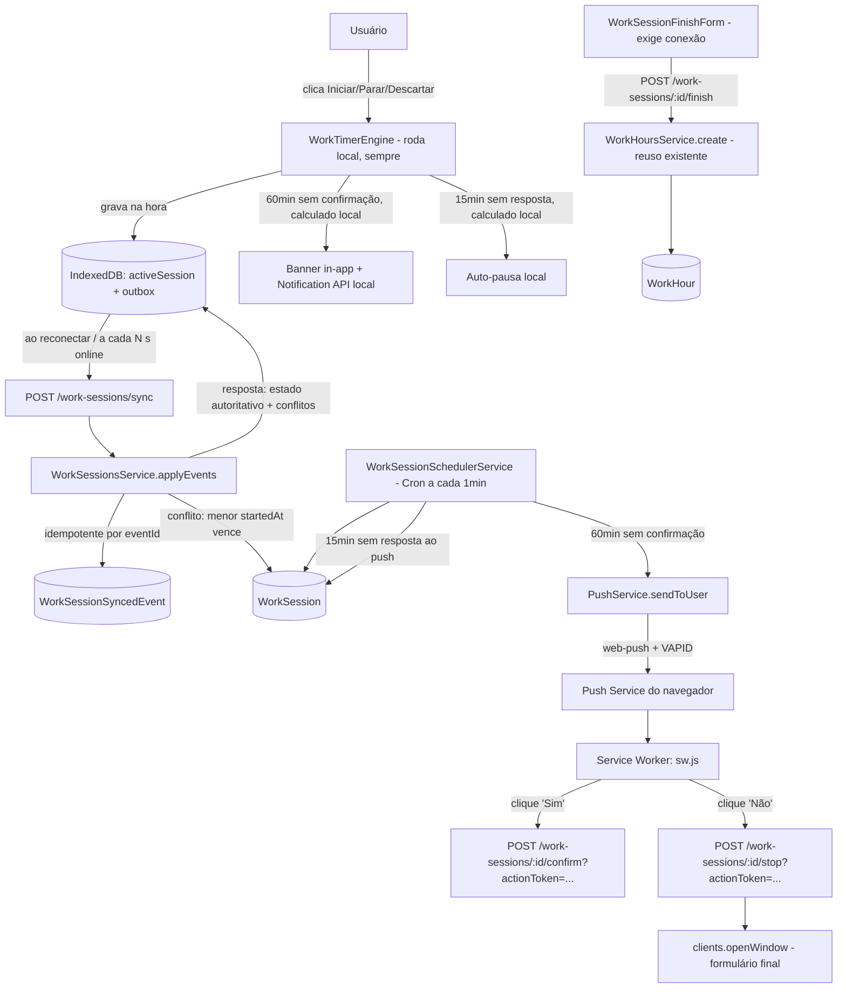

# Work Timer Design

**Spec**: `.specs/features/work-timer/spec.md`
**Context**: `.specs/features/work-timer/context.md`
**Status**: Approved

---

## Architecture Overview

**Revisão (local-first):** a fonte da verdade *imediata* passa a ser o dispositivo (IndexedDB). O `WorkTimerEngine`, rodando inteiramente no cliente, é quem decide start/confirm/pause/stop na hora, com o timestamp real do clique — nunca espera o servidor pra refletir na UI. Toda ação vira um evento (`{eventId, sessionId, type, clientTimestamp, payload?}`) guardado numa outbox local. Uma rotina de sincronização (ao reconectar + a cada N segundos enquanto online) manda a outbox pro backend num único endpoint (`POST /work-sessions/sync`), que aplica os eventos em ordem, de forma idempotente por `eventId`, resolve conflito de "sessão única" comparando `startedAt`, e devolve o estado autoritativo — o dispositivo então sobrescreve seu espelho local com essa verdade. O servidor continua sendo quem garante consistência entre dispositivos e quem dispara o Web Push real (pra alcançar um dispositivo com o app fechado, mas com internet); o próprio dispositivo, quando está com a sessão RUNNING, roda a mesma regra de 60min/15min localmente (com o relógio dele), então o aviso e a pausa automática funcionam mesmo 100% offline. O formulário final (`finish`) continua exigindo conexão — não é local-first — porque depende de carregar clientes/projetos do servidor.



---

## Code Reuse Analysis

### Existing Components to Leverage

| Component                              | Location                                                | How to Use                                                                 |
| --------------------------------------- | -------------------------------------------------------- | ---------------------------------------------------------------------------- |
| `WorkHoursService.create()`            | `apps/backend/src/work-hours/work-hours.service.ts`     | Chamado diretamente por `WorkSessionsService.finish()` pra criar o `WorkHour` final — zero duplicação da lógica de criação/validação já existente |
| `ClientCombobox`, `ProjectCombobox`    | `apps/frontend/src/components/ui/`                      | Reusados no novo `WorkSessionFinishForm` (mesmos componentes de seleção do formulário manual) |
| Padrão de módulo NestJS (module/controller/service/dto) | qualquer módulo em `apps/backend/src/*`                 | Novo `work-sessions` e `push` seguem a mesma estrutura                     |
| Padrão de service React Query          | `apps/frontend/src/services/*.ts`                       | `useFinishWorkSession` em `work-sessions.ts` segue o mesmo padrão (`useMutation`) já usado em `time-entries.ts` — o restante do ciclo de vida do timer não passa por React Query, é local-first (ver `work-timer-engine.ts`) |
| `NotificationLog`-like padrão de idempotência | `apps/backend/prisma/schema.prisma` (`NotificationLog`) | Inspira o campo `lastPromptAt` em `WorkSession`, que evita reenvio duplicado do aviso horário |
| Design system (Cards temáticos, PageHeader, BigStatsDisplay) | `apps/frontend/src/components/`                          | Widget do timer e modal do formulário final seguem o mesmo estilo visual já estabelecido |

### Integration Points

| System                          | Integration Method                                                                 |
| -------------------------------- | -------------------------------------------------------------------------------------- |
| Prisma / PostgreSQL             | Dois modelos novos (`WorkSession`, `PushSubscription`) + 1 enum (`WorkSessionStatus`) |
| `apps/frontend/src/services/push.ts` | **Não reusado.** Seu formato (`to`, `icon`, `badge`, `sound`, `clickAction`) é de push mobile-style (Expo/FCM), incompatível com o formato de subscription do Web Push (endpoint + chaves). Ver Risco abaixo. |
| `@nestjs/schedule` (novo)        | Cron a cada minuto pro aviso horário + pausa automática                             |
| `web-push` (novo, npm)           | Encapsulado em `PushService`, usando VAPID                                          |
| `idb` (novo, npm, frontend)      | Wrapper leve de IndexedDB usado por `work-timer-db.ts` pra armazenar sessão ativa + outbox local |

---

## Components

### Backend — `apps/backend/src/work-sessions/`

- **Purpose**: Aplica os eventos do timer local-first (iniciar, confirmar, pausar, parar, descartar) de forma idempotente, resolve conflito de sessão única, e finaliza a sessão gerando o `WorkHour`.
- **Location**: `apps/backend/src/work-sessions/`
- **Interfaces** (`work-sessions.controller.ts`, `JwtAuthGuard` exceto onde indicado):
  - `POST /work-sessions/sync` — body `{ events: SessionEvent[] }`, onde `SessionEvent = { eventId: string, sessionId: string, type: 'start'|'confirm'|'pause'|'stop'|'discard', clientTimestamp: string }`. Aplica cada evento em ordem, dentro de uma transação por usuário (evita corrida entre duas sincronizações simultâneas do mesmo usuário); ignora (idempotente) `eventId` já presente em `WorkSessionSyncedEvent`. Resposta: `{ session: WorkSessionDto | null, discarded?: { sessionId, reason } }` — o estado autoritativo atual do usuário, e se a sessão local do próprio dispositivo foi descartada por conflito
  - `GET /work-sessions/active` — variante de leitura pura (sem eventos), usada por um dispositivo que abre sem nenhuma sessão local conhecida (ex.: primeiro login); mesma forma de resposta que `sync` com `events: []`
  - `POST /work-sessions/:id/confirm` — só via `?actionToken=` (fluxo da notificação push, sem outbox — ver `ActionTokenService`); equivalente a aplicar um evento `confirm` com `clientTimestamp = now`
  - `POST /work-sessions/:id/stop` — só via `?actionToken=`; equivalente a um evento `stop` com `clientTimestamp = now`
  - `POST /work-sessions/:id/finish` — `Authorization: Bearer` normal (não local-first, exige conexão); body `{ clientId, projectId?, description }`; cria o `WorkHour` via `WorkHoursService.create()` e marca ENDED
- **Dependencies**: `PrismaService`, `WorkHoursService` (import de `WorkHoursModule`), `PushService` (import de `PushModule`), `ActionTokenService`
- **Reuses**: `WorkHoursService.create()`

### Backend — `WorkSessionsService.applyEvents()` (núcleo da resolução de conflito)

- **Purpose**: Aplica uma lista de eventos de sessão ao estado do banco, com a regra de conflito de sessão única.
- **Location**: `apps/backend/src/work-sessions/work-sessions.service.ts`
- **Lógica por tipo de evento** (todas com `clientTimestamp` limitado — clamp — entre `[currentSegmentStartedAt ?? startedAt, now do servidor]`, e evento `start` adicionalmente rejeitado se `clientTimestamp` for mais de 7 dias no passado):
  - `start`: se não há sessão ativa (RUNNING/PAUSED/STOPPING) do usuário → cria com `id` = `sessionId` do evento (gerado no cliente), `startedAt = currentSegmentStartedAt = clientTimestamp`, status RUNNING. Se já existe uma ativa de **outra** sessão: compara `startedAt` — a de `startedAt` maior é descartada (DISCARDED), a de `startedAt` menor vira/continua autoritativa. Isso pode significar descartar retroativamente uma sessão já em uso por outro dispositivo (ver Risco).
  - `confirm`: `lastConfirmedAt = clientTimestamp`, `lastPromptAt = null`; se PAUSED → `status = RUNNING`, `currentSegmentStartedAt = clientTimestamp`
  - `pause`: se RUNNING → `accumulatedSeconds += clientTimestamp - currentSegmentStartedAt`, `currentSegmentStartedAt = null`, `status = PAUSED`
  - `stop`: mesmo congelamento do `pause`, porém `status = STOPPING` e `hours` calculado e arredondado (múltiplo de 15min)
  - `discard`: `status = DISCARDED`
- **Dependencies**: `PrismaService`
- **Reuses**: nada existente

### Backend — `WorkSessionSchedulerService`

- **Purpose**: Job periódico que dispara os avisos horários e aplica a pausa automática.
- **Location**: `apps/backend/src/work-sessions/services/work-session-scheduler.service.ts`
- **Interfaces**:
  - `@Cron(CronExpression.EVERY_MINUTE) async tick(): Promise<void>` — varre `WorkSession` com status RUNNING:
    1. Onde `now - COALESCE(lastConfirmedAt, startedAt) >= 60min` e (`lastPromptAt` nulo ou anterior a `COALESCE(lastConfirmedAt, startedAt)`) → gera novo `promptNonce`, chama `PushService.sendToUser(userId, payload com actionToken)`, seta `lastPromptAt = now`
    2. Onde `lastPromptAt` não nulo e `now - lastPromptAt >= 15min` → congela `accumulatedSeconds += now - currentSegmentStartedAt`, `currentSegmentStartedAt = null`, `status = PAUSED`
- **Dependencies**: `PrismaService`, `PushService`, `ActionTokenService`
- **Reuses**: `PushService`

### Backend — `ActionTokenService`

- **Purpose**: Gera e valida o token de ação de uso único embutido no push, permitindo que o Service Worker confirme/encerre a sessão sem sessão NextAuth.
- **Location**: `apps/backend/src/work-sessions/services/action-token.service.ts`
- **Interfaces**:
  - `issue(sessionId: string, nonce: string): string` — JWT curto (~30min) assinado com `JWT_SECRET` existente, claims `{ sessionId, nonce, scope: 'work-session-action' }`
  - `verify(sessionId: string, token: string): boolean` — valida assinatura, expiração, `sessionId` e que `nonce` bate com o `promptNonce` atual da sessão no banco (invalida automaticamente após rotação do nonce na próxima chamada de `confirm`/`stop`/no próximo ciclo do cron — trata o duplo-clique como no-op)
- **Dependencies**: `@nestjs/jwt` (já usado em `AuthModule`, reuso direto do mesmo `JwtService`/segredo)
- **Reuses**: infraestrutura JWT já existente em `AuthModule`

### Backend — `apps/backend/src/push/` (módulo novo, genérico)

- **Purpose**: Infra de Web Push (VAPID) reutilizável por qualquer feature futura, não só o timer.
- **Location**: `apps/backend/src/push/`
- **Interfaces**:
  - `POST /push/subscriptions` — salva/atualiza a subscription do navegador atual pro usuário logado
  - `PushService.sendToUser(userId: string, payload: { title, body, data, actions? }): Promise<void>` — envia pra todas as subscriptions do usuário; em erro 404/410 do serviço de push, remove a subscription (WKT-08)
- **Dependencies**: `web-push` (npm), `PrismaService`, variáveis de ambiente `VAPID_PUBLIC_KEY` / `VAPID_PRIVATE_KEY` / `VAPID_SUBJECT`
- **Reuses**: nada existente (infra nova) — porém desenhado como módulo próprio, não acoplado a `work-sessions`, pra poder ser reusado depois

### Frontend — `apps/frontend/public/sw.js`

- **Purpose**: Recebe o push, mostra a notificação com ações, e resolve "Sim"/"Não" sem precisar abrir o app.
- **Location**: `apps/frontend/public/sw.js`
- **Interfaces**: listener `push` (mostra notificação com `data.actionToken` e `data.sessionId`), listener `notificationclick` (em "Sim, continuar" → `fetch` no `confirm` com o `actionToken`; em "Não, encerrar" → `fetch` no `stop` com o `actionToken`, seguido de `clients.openWindow('/work-hours/finish-session?sessionId=...')`)
- **Dependencies**: nenhuma lib — Service Worker puro (Push API + Notifications API nativas do navegador)
- **Reuses**: nada — não há service worker no projeto hoje

### Frontend — `apps/frontend/src/lib/work-timer-db.ts` (novo — camada local-first)

- **Purpose**: Encapsula o IndexedDB (`idb`) com dois object stores: `activeSession` (espelho local do estado atual) e `outbox` (eventos pendentes de sincronização).
- **Location**: `apps/frontend/src/lib/work-timer-db.ts`
- **Interfaces**: `getActiveSession()`, `setActiveSession(session)`, `clearActiveSession()`, `enqueueEvent(event)`, `getPendingEvents()`, `ackEvents(eventIds[])`
- **Dependencies**: `idb` (npm, novo)
- **Reuses**: nada — não há storage local estruturado no projeto hoje

### Frontend — `apps/frontend/src/lib/work-timer-engine.ts` (novo — núcleo local-first)

- **Purpose**: Máquina de estados que roda inteiramente no cliente: aplica start/confirm/pause/stop/discard instantaneamente no IndexedDB, calcula o tempo decorrido pra exibição, e replica localmente a regra de 60min (aviso) / 15min (pausa automática) usando o relógio do dispositivo — funciona igual online ou offline.
- **Location**: `apps/frontend/src/lib/work-timer-engine.ts`
- **Interfaces**: `start()`, `confirm()`, `pause()`, `stop()`, `discard()`, `getElapsedSeconds()`, `subscribe(callback)` (notifica a UI a cada tick)
- **Dependencies**: `work-timer-db.ts`
- **Reuses**: nada — é a peça nova que a feature introduz

### Frontend — `apps/frontend/src/lib/work-timer-sync.ts` (novo — sincronização)

- **Purpose**: Ao detectar `online` (evento do navegador) e periodicamente enquanto online, lê a outbox do IndexedDB, chama `POST /work-sessions/sync`, aplica a resposta (estado autoritativo, possível descarte por conflito) de volta no `work-timer-engine`, e remove da outbox os eventos confirmados.
- **Location**: `apps/frontend/src/lib/work-timer-sync.ts`
- **Interfaces**: `startSyncLoop()`, `syncNow(): Promise<void>`
- **Dependencies**: `work-timer-db.ts`, `api` (axios já configurado)
- **Reuses**: `api` (padrão axios existente)

### Frontend — `apps/frontend/src/services/work-sessions.ts`

- **Purpose**: Hook de React Query fino, só pra expor o estado do `work-timer-engine` (via `subscribe`) aos componentes React, e disparar `finish`/`GET active` (únicas chamadas realmente online-only).
- **Location**: `apps/frontend/src/services/work-sessions.ts`
- **Interfaces**: `useWorkTimerEngine()` (lê do engine local, não do backend), `useFinishWorkSession()`
- **Dependencies**: `work-timer-engine.ts`, `api` (axios já configurado)
- **Reuses**: padrão de `apps/frontend/src/services/time-entries.ts` pro `useFinishWorkSession`

### Frontend — `apps/frontend/src/hooks/use-push-subscription.ts`

- **Purpose**: Pede permissão, registra o service worker, assina o push e envia a subscription ao backend.
- **Location**: `apps/frontend/src/hooks/use-push-subscription.ts`
- **Interfaces**: `usePushSubscription(): { permission, subscribe }`
- **Dependencies**: `navigator.serviceWorker`, `PushManager`, `NEXT_PUBLIC_VAPID_PUBLIC_KEY`

### Frontend — `WorkTimerWidget`

- **Purpose**: Botão Iniciar / contador rodando / banner in-app de "ainda está trabalhando?" (fallback sem push).
- **Location**: `apps/frontend/src/components/work-timer/work-timer-widget.tsx`
- **Interfaces**: componente autocontido, sem props — usa `useWorkTimerEngine`
- **Dependencies**: `useWorkTimerEngine` (start/confirm/pause/stop/discard chamam o engine local direto, nunca a API)
- **Reuses**: `Card`, `Button` (design system existente)
- **Onde vive**: incluído no layout autenticado (`(authenticated)/layout.tsx`), visível em todas as páginas — decisão de Design, já que nenhuma tela específica foi indicada em `context.md`

### Frontend — `WorkSessionFinishForm`

- **Purpose**: Formulário final (cliente obrigatório, descrição obrigatória, projeto opcional) + opção de descartar.
- **Location**: `apps/frontend/src/components/work-timer/work-session-finish-form.tsx`
- **Interfaces**: props `{ session, onSuccess }`
- **Dependencies**: `useFinishWorkSession`, `useDiscardWorkSession`
- **Reuses**: `ClientCombobox`, `ProjectCombobox`, `Textarea`, `Button` (primitivos do `work-hour-form.tsx`, **não** o componente inteiro — ver Tech Decisions)

---

## Data Models

### `WorkSession`

```typescript
enum WorkSessionStatus {
  RUNNING
  PAUSED
  STOPPING   // congelada, aguardando formulário final
  ENDED      // finalizada, WorkHour criado
  DISCARDED  // descartada, sem WorkHour
}

interface WorkSession {
  id: string                             // gerado no CLIENTE (UUID) no momento do start local, não pelo banco
  userId: string
  status: WorkSessionStatus
  startedAt: Date
  currentSegmentStartedAt: Date | null   // null quando não está RUNNING
  accumulatedSeconds: number             // soma dos segmentos RUNNING já fechados
  lastPromptAt: Date | null              // último aviso horário enviado
  lastConfirmedAt: Date | null           // última confirmação "ainda trabalhando"
  promptNonce: string | null             // rotaciona a cada aviso; invalida actionTokens antigos
  clientId: string | null                // preenchido só no finish
  projectId: string | null
  description: string | null
  hours: number | null                   // duração final arredondada, preenchida no stop
  createdAt: Date
  updatedAt: Date
}
```

**Relationships**: `WorkSession.userId → User.id`. `WorkSession` NÃO se relaciona com `WorkHour` diretamente — ao finalizar, cria um `WorkHour` independente via `WorkHoursService.create()` (mesma tabela usada pelo fluxo manual).

**Constraint crítica**: índice único parcial (migration SQL manual, Prisma não expressa isso no schema) garantindo no máximo uma sessão `RUNNING`/`PAUSED`/`STOPPING` por `userId`:

```sql
CREATE UNIQUE INDEX "WorkSession_one_active_per_user"
ON "WorkSession" ("userId")
WHERE status IN ('RUNNING', 'PAUSED', 'STOPPING');
```

Isso é o que resolve o edge case de duas abas tentando iniciar simultaneamente (a segunda inserção falha por violação de constraint; o service captura o erro do Prisma e retorna a sessão já existente).

### `PushSubscription`

```typescript
interface PushSubscription {
  id: string
  userId: string
  endpoint: string    // @unique
  p256dh: string
  auth: string
  userAgent: string | null
  createdAt: Date
}
```

**Relationships**: `PushSubscription.userId → User.id` (1:N — um usuário pode ter várias subscriptions, uma por navegador/dispositivo).

### `WorkSessionSyncedEvent` (novo — idempotência do sync local-first)

```typescript
interface WorkSessionSyncedEvent {
  eventId: string    // @id — gerado no cliente, único globalmente
  sessionId: string
  type: string
  appliedAt: Date
}
```

**Relationships**: nenhuma FK obrigatória pra `WorkSession` (a sessão referenciada pode já ter sido descartada por conflito) — existe só pra registrar "esse `eventId` já foi processado, não aplicar de novo".

---

## Error Handling Strategy

| Error Scenario | Handling | User Impact |
| --------------- | --------- | ------------ |
| Iniciar sessão sem internet | Aplicado local imediatamente (local-first); nada a tratar como "erro" | Nenhum — funciona normalmente, sincroniza depois |
| Duas sessões criadas offline em dispositivos diferentes | `applyEvents` resolve por `startedAt` menor; a perdedora vira DISCARDED, inclusive retroativamente | Dispositivo perdedor recebe toast discreto na próxima sincronização |
| Corrida entre duas sincronizações simultâneas do mesmo usuário (dois `sync` ao mesmo tempo) | Transação por usuário + constraint única no banco como rede de segurança; em conflito de escrita, um dos dois é reprocessado | Nenhum erro visível — resultado final é consistente |
| `actionToken` inválido/expirado/reusado | 401/403 na rota; Service Worker não tenta abrir o app nesse caso, só ignora silenciosamente | Notificação clicada não faz nada visível; próximo aviso horário chega normalmente |
| Envio de push falha com 404/410 (subscription morta) | `PushService` remove a subscription do banco | Nenhum (silencioso) — se era a única subscription do usuário, próximos avisos só aparecem como banner in-app |
| `projectId` não pertence ao `clientId` no finish | `WorkHoursService.create()` já teria essa checagem? **Ver Risco abaixo — não existe hoje.** | Erro de validação retornado ao formulário |
| Sessão já STOPPING/ENDED e usuário tenta `confirm`/`stop` de novo | No-op, retorna 200 com o estado atual | Nenhum efeito colateral |

---

## Risks & Concerns

| Concern | Location | Impact | Mitigation |
| ------- | -------- | ------ | ---------- |
| `apps/frontend/src/services/push.ts` já existe chamando `/push/send`, endpoint que nunca existiu no backend | `apps/frontend/src/services/push.ts` | Código morto/quebrado hoje; pode confundir quem for mexer depois achando que push já funciona | Não tocar nesse arquivo nesta feature (fora de escopo); documentar na Tasks que ele continua não-funcional e não deve ser confundido com a infra nova de Web Push |
| `CreateWorkHourDto`/`WorkHoursService.create()` **não valida** que `projectId` pertence ao `clientId` informado | `apps/backend/src/work-hours/work-hours.service.ts:18-35` | Um `WorkHour` (inclusive vindo do timer) pode ser criado com projeto de outro cliente | Adicionar a validação em `WorkHoursService.create()` (beneficia os dois fluxos, manual e timer) como parte da Task que implementa `finish()` — vira requisito derivado do Edge Case do spec, não scope creep, já que o spec exige essa checagem |
| Cron de 1 em 1 minuto varrendo todas as sessões RUNNING | `work-session-scheduler.service.ts` (novo) | Se o backend rodar em múltiplas instâncias (Railway com >1 réplica), o mesmo push pode ser enviado 2x | Documentar como premissa: backend roda em instância única no Railway hoje (ver `RAILWAY.md`/config atual); se isso mudar, será necessário lock distribuído — fora do escopo desta feature |
| `web-push` e `@nestjs/schedule` são dependências novas | `package.json` (backend) | Aumenta superfície de dependências | Ambas são bibliotecas padrão de mercado pro caso de uso (confirmado via busca — `web-push` é a lib de referência pra VAPID em Node, `@nestjs/schedule` é o pacote oficial do NestJS pra cron) |
| Nenhum teste de integração cobre hoje o fluxo de criação de `WorkHour` de ponta a ponta | `apps/backend/src/work-hours/*.spec.ts` (verificar cobertura atual na fase de Tasks) | Risco de regressão ao tocar em `WorkHoursService` pra adicionar a validação de projeto/cliente | Tasks deve incluir teste cobrindo a validação nova antes de mexer no service (TDD) |
| Descarte retroativo de sessão (local-first) pode apagar minutos de uso real de um dispositivo que já estava "ativo" | `WorkSessionsService.applyEvents` (`start`) | Usuário pode ver uma sessão em uso sumir e ser substituída por outra, mesmo já tendo confirmado presença ou avançado nela | Comportamento aceito explicitamente pelo usuário (ver `context.md`); mitigado só por um toast claro explicando o que aconteceu — nenhuma tentativa de "salvar" a sessão perdedora, por decisão de escopo |
| Regra de 60min/15min duplicada em dois lugares (`work-timer-engine.ts` no frontend e `WorkSessionSchedulerService`/`applyEvents` no backend) | `apps/frontend/src/lib/work-timer-engine.ts` + `apps/backend/src/work-sessions/services/work-session-scheduler.service.ts` | Se um dos dois lados mudar a regra (ex.: alterar a janela de graça) sem replicar no outro, cliente e servidor divergem sobre quando pausar | Documentar os dois números (60min/15min) como constantes nomeadas nos dois lados, com comentário cruzado apontando um pro outro; Tasks deve cobrir os dois com teste |
| IndexedDB pode não estar disponível (navegação anônima com bloqueio de storage, navegadores antigos) | `apps/frontend/src/lib/work-timer-db.ts` (novo) | Timer não teria onde persistir localmente | Fora do escopo desta feature tratar navegadores sem suporte a IndexedDB (baseline do projeto já assume navegador moderno, mesma baseline do Service Worker/Push API) — se `idb` falhar ao abrir, a feature degrada mostrando erro claro ao tentar iniciar, em vez de falhar silenciosamente |

---

## Tech Decisions (only non-obvious ones)

| Decision | Choice | Rationale |
| -------- | ------ | --------- |
| Modelo de estado da sessão | Registro mutável (`accumulatedSeconds` + `currentSegmentStartedAt`) em vez de event sourcing | Confirmado com o usuário — suficiente pro escopo, muito menos código |
| Autenticação das ações da notificação | Token de ação de uso único (JWT curto, escopado a `sessionId` + `nonce`), embutido no payload do push | Confirmado com o usuário — Service Worker não acessa a sessão NextAuth (`getSession()` só funciona na página aberta) |
| `WorkSessionStatus.STOPPING` como estado intermediário | Sessão "parada" mas ainda sem `WorkHour` continua contando como ativa (bloqueia novo início) até `finish`/`discard` | Sem isso, dois dispositivos poderiam divergir sobre se já dá pra iniciar uma nova sessão enquanto o formulário final ainda não foi preenchido em nenhum lugar |
| `WorkSession` não referencia `WorkHour` via FK | Cria um `WorkHour` novo e independente no `finish()`, reusando `WorkHoursService.create()` | Mantém o `WorkHour` como a única fonte de verdade de horas faturáveis, sem introduzir um segundo caminho de leitura pros relatórios/faturas existentes |
| Widget do timer no layout autenticado (visível em toda página) | Ver componente `WorkTimerWidget` | Nenhuma tela específica foi indicada; um timer rodando precisa ser visível independente da página em que o usuário está (padrão comum em ferramentas de time tracking) |
| Índice único parcial via SQL manual na migration | Não expressável no `schema.prisma` puro | É a única forma de garantir "uma sessão ativa por usuário" com integridade no banco, cobrindo a race condition do edge case do spec |
| Arquitetura local-first (IndexedDB + outbox) em vez de API síncrona online-only | `work-timer-engine.ts` / `work-timer-db.ts` / `work-timer-sync.ts` (novos) | Confirmado com o usuário — pensando numa versão mobile futura; timer precisa funcionar sem internet |
| `id` da `WorkSession` gerado no cliente, não pelo banco | `schema.prisma` (`WorkSession.id` sem `@default(uuid())`) | Necessário pra local-first: a sessão precisa de identidade antes de qualquer contato com o servidor |
| Sincronização via endpoint único de eventos (`/work-sessions/sync`) em vez de endpoints separados por ação | `work-sessions.controller.ts` | Espelha naturalmente o modelo de outbox local-first (lista de eventos pendentes) — evita reinventar "uma chamada por tipo de ação" que não existiria offline |
| Resolução de conflito de sessão única por `startedAt` mais antigo, com descarte automático (mesmo retroativo) | `WorkSessionsService.applyEvents` | Confirmado com o usuário — regra determinística e simples de explicar, aceitando o efeito colateral de descarte retroativo |
| Regra de 60min/15min replicada no cliente (`work-timer-engine.ts`) além do servidor | Ver Risco correspondente | Sem isso, um dispositivo 100% offline nunca dispararia o aviso horário nem a pausa automática — quebraria o requisito local-first |
| Formulário final (`finish`) fica de fora do local-first | `work-session-finish-form.tsx` | Decisão explícita do usuário — não cachear listas de cliente/projeto agora; escopo contido |

> **Decisão de projeto registrada:** a arquitetura local-first (IndexedDB + outbox de eventos + sync idempotente) virou `AD-001` em `.specs/STATE.md`, já que futuras features que precisem sobreviver a perda de conexão devem seguir o mesmo padrão. As demais decisões desta tabela (token de ação de uso único, `STOPPING` como estado intermediário, etc.) permanecem locais a esta feature — se alguma for reaproveitada por outra feature de push/timer no futuro, deve ser promovida a `AD-NNN` naquele momento.
