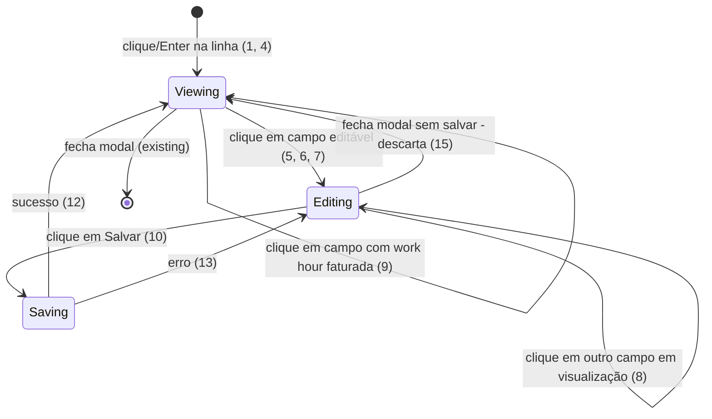

# Remover botão de editar da tabela de horas - visualização e edição por campo no modal

> Build this with **tlc-implement**.
> Cada critério abaixo vira um check com uma prova, referenciado pelo número. Nada em
> `Unresolved` é resolvido durante a implementação.

## Intent

Hoje, pra editar uma work hour, o usuário precisa mirar num ícone pequeno de lápis que só
aparece no hover da linha (`work-hours-table.tsx:293-314`), competindo por espaço com o botão de
excluir na mesma célula. O modal que abre em seguida (`FormModal` + `WorkHourForm`) já entra
direto em modo de edição, com todos os três campos editáveis (`date`, `hours`, `description`) e o
botão "Salvar" sempre visível - não há como só consultar uma work hour sem já estar em posição de
alterá-la.

A mudança: o botão de editar sai da tabela. Clicar em qualquer parte da linha (fora dos botões de
ação) abre o mesmo modal, mas agora em modo de visualização, sem botão "Salvar". Cada campo
(`date`, `hours`, `description`) só vira editável quando o usuário clica nele; o botão "Salvar"
aparece assim que pelo menos um campo estiver em edição, e um único clique nele salva todos os
campos alterados de uma vez.

15 critérios em 3 slices · 1 porta de mão única · 1 aberto, dos quais 0 bloqueiam

## Criteria

### Abrir o modal pelo clique na linha

1. Given a tabela de horas renderizada, when o usuário clica em qualquer área de uma `TableRow`
   fora das células de ação, then o modal de detalhes da work hour abre em modo de visualização
   (nenhum campo editável, nenhum botão "Salvar" visível).
2. Always, o botão de ícone `Edit` (lucide-react) não é mais renderizado na célula de ações da
   tabela.
3. Given uma linha da tabela, when o usuário clica no botão de excluir (dentro do `AlertDialog`
   existente), then o modal de visualização não abre - o clique não se propaga pra `TableRow`.
4. Always, a `TableRow` tem `role="button"` e `tabIndex={0}`, e pressionar `Enter` ou `Espaço` com
   foco na linha abre o mesmo modal de visualização que o clique do mouse.

### Editar por campo dentro do modal

5. Given o modal aberto em modo de visualização, when o usuário clica no valor exibido do campo
   "Data", then esse campo vira o input editável já usado hoje em `WorkHourForm` e o botão
   "Salvar" aparece no rodapé do modal.
6. Given o modal aberto em modo de visualização, when o usuário clica no valor exibido do campo
   "Horas", then esse campo vira o input com a máscara `HH:mm` já existente e o botão "Salvar"
   aparece.
7. Given o modal aberto em modo de visualização, when o usuário clica no valor exibido do campo
   "Descrição", then esse campo vira o input/textarea editável e o botão "Salvar" aparece.
8. Given um ou mais campos já em edição, when o usuário clica em outro campo ainda em
   visualização, then esse campo também vira editável, os anteriores continuam editáveis, e
   apenas um botão "Salvar" é exibido (não um por campo).
9. Given a work hour vinculada a uma invoice com status diferente de `CANCELED`
   (`isWorkHourInvoiced` retorna `true`), then nenhum campo responde a clique - permanecem em
   modo de visualização - e o modal exibe um aviso fixo reaproveitando a string `cannotEditInvoiced`
   já usada hoje como tooltip do botão de editar.

### Salvar as alterações

10. Given pelo menos um campo em edição com valor alterado, when o usuário clica em "Salvar",
    then `useUpdateTimeEntry` é chamado uma única vez com `PATCH /work-hours/:id` contendo somente
    os campos alterados dentre `date`, `hours`, `description`.
11. While a mutação de salvar está pendente (`isPending`), o botão "Salvar" fica desabilitado e
    mostra o spinner já usado hoje no formulário.
12. Given a mutação retorna sucesso, then todos os campos voltam ao modo de visualização com os
    valores atualizados, o botão "Salvar" desaparece, e as mesmas invalidações de query já
    existentes (`timeEntries`, `timeEntries/id`, `workHours/stats`, `clients/stats`, `dashboard`)
    são disparadas.
13. If a mutação retorna erro (ex.: 400 porque a work hour foi faturada entre a abertura do modal
    e o clique em "Salvar"), then os campos alterados permanecem em modo de edição com os valores
    digitados preservados, e o `Alert` de erro já existente em `WorkHourForm` exibe a mensagem
    retornada pela API.
14. Always, enquanto nenhum campo tiver sido clicado para edição, nenhum botão "Salvar" é exibido
    no modal.
15. Given um ou mais campos em edição sem terem sido salvos, when o usuário fecha o modal (X,
    clique fora, ou `Esc`), then as alterações não são persistidas; reabrindo o modal pra mesma
    work hour, ele volta a abrir em modo de visualização com os valores originais.

## States

## Out of scope

- Editar `projectId`/`clientId` pelo modal - `UpdateWorkHourDto` do backend não aceita
  `projectId`, e o formulário já esconde esses campos no modo edição hoje.
- Confirmação de "descartar alterações" ao fechar o modal com edições não salvas - descarte é
  silencioso (critério 15), sem diálogo de confirmação; nenhum padrão desse tipo existe hoje no
  app.
- Alterar o comportamento do botão de excluir (`AlertDialog`) - inalterado por esta task.
- Alterar a regra de negócio que bloqueia edição de work hours faturadas - o bloqueio já existe
  no backend (`WorkHoursService.update`) e no frontend (`isWorkHourInvoiced`); só a forma de
  sinalizar na UI muda (critério 9).

## Observable

| Surface | Decision | Landing |
| --- | --- | --- |
| modal "detalhes da work hour" | empty state | n/a - só abre pra uma work hour já carregada na lista |
| modal "detalhes da work hour" | loading state | n/a - `clients` já está carregado antes da tabela ficar interativa (`page.tsx` retorna cedo enquanto `isInitialLoading`) |
| modal "detalhes da work hour" | error state | 13 |
| modal "detalhes da work hour" | unauthorised state | existing - `WorkHoursService.update` valida `req.user.id`, sem UI nova |
| modal "detalhes da work hour" | destructive action confirma antes | existing - `AlertDialog` de exclusão já presente na linha, inalterado |
| modal "detalhes da work hour" | densidade/ordenação | n/a - nenhuma mudança na ordenação ou agrupamento da tabela |
| tabela de horas (linha) | empty state | existing - `data-testid="empty-state"` já cobre tabela sem work hours |
| API `PATCH /work-hours/:id` | forma de resposta e erro | existing - contrato já usado hoje por `WorkHourForm`, sem mudança |
| API `PATCH /work-hours/:id` | quem pode chamar | existing - guard de autenticação e ownership já aplicados no controller/service |
| API `PATCH /work-hours/:id` | versionamento | n/a - endpoint interno, sem consumidor externo |
| API `PATCH /work-hours/:id` | comportamento no rate limit | n/a - fora de escopo, herdado do endpoint já existente |

## Swept

- validation: existing - reaproveita `editWorkHourFormSchema` (zod) no cliente e
  `UpdateWorkHourDto` (class-validator) no servidor; a edição por campo não muda as regras
- failure modes: 13
- idempotency and retry: n/a - nenhum retry automático introduzido; um segundo clique em Salvar
  durante `isPending` já fica bloqueado (11)
- authorization: existing - `WorkHoursService.update` continua validando `req.user.id` e o
  bloqueio de invoiced (400) no servidor, independente da checagem client-side (9)
- concurrency and ordering: 13 - cobre o caso da work hour ser faturada entre a abertura do
  modal e o clique em Salvar
- data lifecycle: n/a - não cria nem apaga work hours, só atualiza campos já existentes
- external-dependency failure: 13 - mesmo `Alert` de erro cobre falha de rede/API
- state transitions: 5, 6, 7, 8, 12, 13, 15 (ver diagrama em States)
- observability: n/a - não solicitado; nenhum log ou métrica nova nesta task

## Impact

| Front | What changes |
|---|---|
| domain | existing term: "editar work hour" antes disparado por botão dedicado na linha (`onEdit` prop de `WorkHoursTable`), agora por clique na linha + clique no campo - consumidores diretos: `work-hours/page.tsx` (`handleEdit`), `WorkHoursTable`, `WorkHourForm` |
| tests | `work-hours-table.test.tsx` - 3 testes buscam `getByRole("button", { name: "edit workHour" })`, precisam ser reescritos pra simular clique/Enter na linha |
| tests | `work-hours/__tests__/page.test.tsx` - mock de `WorkHoursTable` e o teste "should open edit modal..." (linhas ~121-126, ~258-273) usam o botão "edit work hour", precisam simular clique na linha |
| stored data | nothing to migrate - nenhuma mudança de schema, DTO ou payload persistido |

## Decided

| Decision | Shape | Alternative rejected |
|---|---|---|
| Padrão de interação visualizar→editar-por-campo com salvar único (não existe hoje no codebase, vira precedente) | Estado local por campo (ex.: `Set` dos nomes de campo em edição) alterna cada campo entre view/edit dentro do modal; um único botão "Salvar" no rodapé dispara um `PATCH /work-hours/:id` com todos os campos alterados | Edição de um campo por vez (serializado: editar → salvar/cancelar → só então editar outro) - rejeitada pelo usuário: exigiria bloquear os demais campos até cada edição terminar, contrariando o fluxo de editar vários campos e salvar tudo junto |

## Sources

- Pedido do usuário nesta conversa - define o comportamento base: sem botão de editar na tabela,
  clique na linha abre modal de visualização sem botão salvar, clique no campo libera edição e
  mostra o botão salvar
- Respostas às perguntas de esclarecimento nesta conversa - `user delegated`: múltiplos campos
  podem ficar em edição simultânea com um único botão "Salvar" (critério 8, 10); work hours
  faturadas ficam com campos não clicáveis e aviso fixo reaproveitando `cannotEditInvoiced`
  (critério 9)

Esta task é o registro da decisão. Se um documento vinculado divergir, perguntar antes de
construir.

## Unresolved

| # | Kind | Question | Until answered |
|---|---|---|---|
| 1 | open | O modal em modo de visualização deve exibir `client`/`project` como informação somente-leitura, já que o formulário de edição atual não inclui esses campos? | Assumido que não - o modal mostra apenas os mesmos 3 campos que `WorkHourForm` já expõe hoje no modo edição: `date`, `hours`, `description` |
